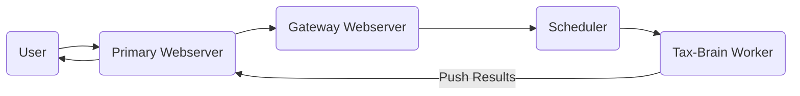
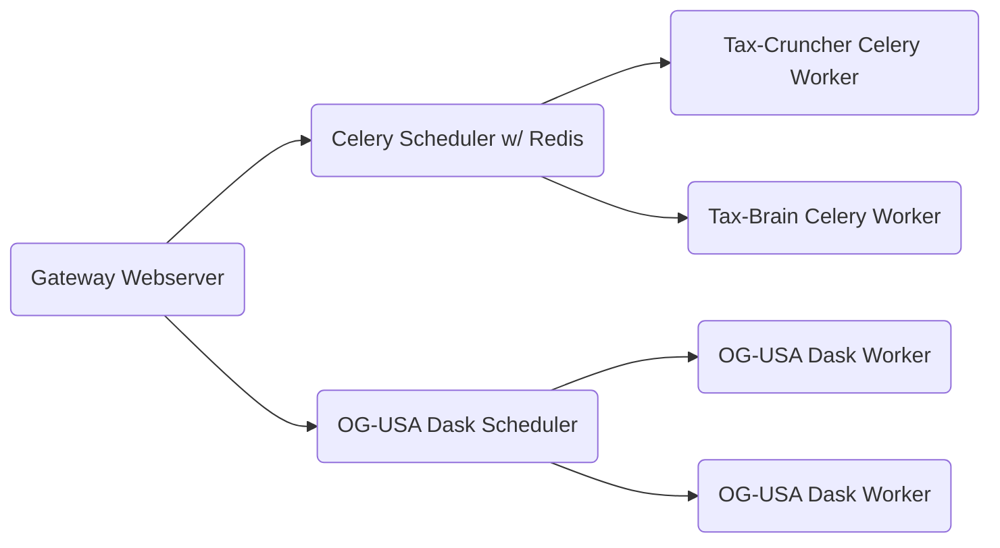

# Compute Studio 0.16.0

**Highlights:**

- Models can use dask clusters for parallel computations.
- Streamlined deployment process with C/S Cluster

Compute Studio [0.16.0][1] adds beta support for models that use [Dask][2] to parallelize their workloads across multiple cores, threads, or even servers. In preparation for this, the C/S deployment process was streamlined from multiple scripts and Docker commands to a single Python class that provides a user-friendly and extendable API. While Dask is useful even on a single laptop, projects like [Distributed][3] and [Dask-Kubernetes][4] have made it easy to take advantage of the practically infinite amount of computing available in the cloud. This ecosystem and the streamlined deployment process make it possible for C/S modelers to publish faster, more scalable models with Dask.

### Dask Clusters

Over the past few weeks, I worked with Jason DeBacker and Rick Evans who are core-maintainers of [OG-USA][5], a dynamic model of the economy of the United States, to get OG-USA ready to be published on C/S and to get C/S ready for OG-USA. Using dask with the C/S compute cluster has been on our list of priorities for some time, but OG-USA's use of Dask pushed it to the top of our priority list. 

Before we get into Dask and Compute studio, let's cover how the Compute Studio system works. Simulations originate when you punch in some inputs and click run. Those inputs are submitted to the primary webserver, and if they are valid, they are submitted to the compute cluster. A lightweight gateway webserver is used by the primary webserver to communicate with the compute cluster. So, when the simulation is submitted to the compute cluster, the lightweight webserver receives the simulation inputs and sends them to a scheduler. This scheduler routes the simulation inputs to the correct worker and the worker pushes the results back to the primary webserver. Here's a simple version of this with one model:




Prior to this release, Celery was used to route tasks to the appropriate model and keep track of the tasks' statuses. Once Dask was configured with the C/S cluster, it needed to be wired into our flow of kicking off simulations on the correct workers, querying their status, and pushing the simulation results back to the webserver. The primary difference *in terms of submitting simulations* is that [Celery][9] uses queues for routing the simulations to the right workers. However, Dask-Distributed does not appear to provide a similar routing framework, though it has been [discussed in the past](https://github.com/dask/distributed/issues/2616). For now, each Dask cluster will get its own scheduler. This adds a small amount of complexity to the infrastructure, but it makes it simpler to route simulations to the right workers. As an administrator, I sleep easy knowing that Celery and Redis are powering the C/S compute cluster. However, as a modeler and data scientist, the flexibility of Dask makes me really excited, and I look forward to gaining more experience with it.

With C/S 0.16.0, the compute cluster now looks like this:



OG-USA provided the motivation for adding support for Dask, but it is not the only project that will benefit from it. Tax-Brain already uses Dask, and running it on a Dask cluster will significantly reduce its run time. Further, Dask is a popular open-source project for parallel  computing, and I anticipate that this feature will be used by many  models in the future.

Note that OG-USA is not live yet, but it will be in the next few days.

### C/S Cluster: Deploy a cluster with a few lines of Python

C/S Cluster opens the door to major infrastructure improvements like allowing publishers to trigger automatic updates to their models from the model's C/S dashboard and automating the process of publishing a new model to Compute Studio. If a Kubernetes cluster has already been set up, then you can deploy the entire compute cluster with just a YAML file and a few lines of Python.

First, you're going to need to create a config file with information about the project and what resources it needs.

```yaml
# worker_config.dev.yaml
- owner: PSLmodels
  title: OG-USA
  branch: master
  cluster_type: dask
  replicas: 2
  resources:
    requests:
      memory: 7G
      cpu: 2
    limits:
      memory: 7G
      cpu: 2
  env:
    BUILD_NUM: 0
  secrets: {}
```

Next, create a `cluster` object and tell it which config file you are using, the tag for the deployment, and the name of your Google Cloud project.

```python
from cs_cluster import Cluster

cluster = Cluster(
    config="worker_config.dev.yaml",
    tag="oct30.0",
    project="cs-workers-dev"
)

cluster.build()  # build, tag, and push docker images and write k8s config files.
cluster.apply()  #  apply k8s config files to existing k8s cluster.
```

Then, when some cool new features are added to OG-USA, all you need to do is bump the `BUILD_NUM` in your config file and run:

```python
cluster = Cluster(
    config="worker_config.dev.yaml",
    tag="oct30.1",
    project="cs-workers-dev",
    models=["OG-USA"] # Only update OG-USA.
)

cluster.build()
cluster.apply()
```

The goal is to make it as easy as possible to deploy and make updates to Compute Studio and the models it hosts. This makes C/S maintainers' lives easier by reducing the maintenance burden and making it easier to test. C/S isn't going at this alone--there are other really cool projects that have similar work flows like [JupyterHub][6] and its [Zero to JupyterHub with Kubernetes][7] project that we can learn from.

Thanks to Jason DeBacker for your contributions and feedback to this release.

### What happened to the C/S 0.15.0 write-up?

I was lazy and didn't write it! C/S [0.15.0][8] streamlined the C/S developers API. Thanks to all of the C/S developers for your feedback on the API changes and promptly updating your `cs-config` packages accordingly.


[1]: https://github.com/compute-tooling/compute-studio/releases/tag/0.16.0
[2]: https://dask.org/
[3]: https://distributed.dask.org/en/latest/
[4]: https://kubernetes.dask.org/en/latest/
[5]: https://github.com/PSLmodels/OG-USA#og-usa
[6]: https://jupyter.org/hub
[7]: https://z2jh.jupyter.org/en/latest/
[8]: https://github.com/compute-tooling/compute-studio/releases/tag/0.15.0
[9]: http://www.celeryproject.org/