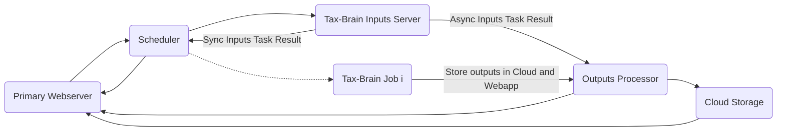

# Compute Studio 1.6

**Highlights:**

- *Almost* automatic publishing and updates using GitHub Actions.
- Increased computational performance and efficiency with Kubernetes Jobs.

## Features Overview

Compute Studio 1.6 represents a huge step towards accomplishing two goals that Matt Jensen and I set for Compute Studio at the beginning of the project. First, we want to make it easy to publish and update models on Compute Studio. Second, we want to efficiently use compute resources while at the same time making sure that users get their results as quickly as possible. This release reduces a significant amount of friction in the model publishing process and opens a clear path for completely automating model publishing. Further, this release drastically reduces C/S server costs while increasing the amount of compute available to the models. Throughout the development of this release, we worked to shore up other parts of the C/S infrastructure. These improvements include more secure secrets management, more isolated model environments, enhanced deployment tooling, and more. The end result vastly improves the current performance of the C/S compute cluster and makes way for future improvements. Thank you to everyone who contributed to this release!

Read on to learn more about what went into C/S 1.6. Or, if you just want to see the code and not the long-winded release notes, you can find it in the [`workers`](https://github.com/compute-tooling/compute-studio/tree/master/workers) package and the [compute-studio-publish](https://github.com/compute-tooling/compute-studio-publish/]) repo.

*If you like what we are doing, check out the C/S [premium plans](https://compute.studio/billing/upgrade/). This is how we fund our server costs and pay my salary as the primary technical developer.*

## Engineering Process

Before getting into the technical details of this release, I just want to say that this was a *really* fun release. The problems that we tackled are challenging, and they forced the C/S team to think through and try several different solutions before figuring out what worked.





### Automatic Publishing with GitHub and GitHub Actions

The crucial insight for automating the publish and update process was that this is really a CI/CD problem. This insight made it clear that we shouldn't build our own tech from scratch, and that we should use GitHub (or another git service like GitLab) as the interface to our CI/CD service. There are several reasons for this:

1. GitHub already supports many types of CI/CD services which allows us to try one service and swap to another if we aren't happy with it.
2. Many developers are familiar with GitHub, making it easy to discuss any build or test errors. Further, any PR's or issues that are created in relation to a particular build all link to the PR with the build failure.
3. GitHub provides a REST API that C/S can use to automate the publish and update process.

I chose [GitHub Actions](https://github.com/features/actions) because it didn't require me to set up other services outside of GitHub. It has predefined flows for doing things like building and publishing Docker images and deploying to a Kubernetes cluster. This made it easy to cobble together several existing configuration files to accomplish the flow that we needed. I also explored Microsoft's Azure Pipelines. Pipelines offers an easy, seamless integration with GitHub; however, it didn't add any additional features relevant to our flow that warranted adding another service to C/S's already complicated technology stack. As an aside, I was disappointed that none of the CI/CD services except for AWS's offering have a *hosted* service with configurable compute resources like number of CPUs and amount of RAM. I would happily pay for this feature if it was available.

Next, I began setting up a git-based flow for publishing and updating models. I created the [`compute-studio-publish`](https://github.com/compute-tooling/compute-studio-publish) repository to serve as the home of the CI/CD service. This separates C/S development from the chatter of model updates. The `compute-studio-publish` repo has a configuration file for each public model on C/S located at `config/:owner/:title.yaml`. An update is triggered when a PR is opened with the model's modified file. Currently, I manually start the update process when I get an automated email notification after a model update on C/S or if a model maintainer asks for an update. In the future, this step will be triggered by a model maintainer from the C/S GUI or REST API.

The update and deploy sequence looks like this:

1. Update the timestamp in the configuration file, and open a PR with the modified file.

2. The PR kicks off a build, test, and push sequence.

3. The build step creates a docker image with all of the model's dependencies.

4. The test step runs the compute-studio tests for this model.

5.  If the tests pass, then the docker image is pushed to the C/S docker image repository and the model's staging tag is updated. If the tests fail, then the build fails. Once the model maintainer fixes the errors, the PR is updated and the build and test process is started again.

6. The PR is merged by a C/S maintainer, and the webapp and compute cluster are updated with the latest version of the model.


### Zero-to-N Scaling with Kubernetes Jobs

Making progress on C/S's goal of automatically publishing models came easily once I realized that this was actually a well-known and very solved problem. After that, the implementation was a matter of tying together various existing services and automating the build/test/deploy steps. Making progress on C/S's scalability problem did not come this easily--it was a year long grind. In the early days of C/S, the models were run on a single Digital Ocean server using docker-compose. Jobs were submitted to the cluster through a Flask API, and the jobs were run by Celery workers. Eventually, I moved the configuration from docker-compose to docker swarm and finally to Kubernetes on Google Cloud Platform (GCP). The move to Kubernetes and GCP made it easier to set up autoscaling rules based on CPU usage for each model's celery workers. This improved C/S's scalability, but it made the compute costs way too high. The reason for the high costs was that each model had to have at least one celery worker running at all times, resulting in a lot of idle servers.

The [first attempt](https://hankdoupe.com/posts/Compute-Studio-0.16.0.html) at fixing this problem was to use [Dask]() and its [Kubernetes](https://kubernetes.dask.org/en/latest/) support to scale compute. We added Dask cluster support as a beta-level feature, but soon discovered that submitting more than two or three simulations at once caused a scheduling traffic jam. Each simulation had several long-running tasks, and each of these tasks held onto one of a Dask worker's threads. Eventually, there wasn't anywhere to schedule sub-tasks and all of the simulations would stall until more workers could be added to the cluster. Next, Matt Jensen and I spent some time exploring projects that were more in the ETL space like [Apache Airflow](https://airflow.apache.org/) and [Prefect](https://docs.prefect.io/). Apache Airflow seemed like a great solution, and in particular, its [Kubernetes support](https://airflow.apache.org/docs/stable/executor/kubernetes.html) looked like it would offer exactly what we needed. However, Airflow seemed to be geared more towards data-science jobs that are scheduled to run on a regular basis and not jobs that need to be run on-demand. Prefect seemed like an evolution from our initial approach of using Dask to schedule jobs, but it felt a little too new for us to base our long-term infrastructure on. Finally, I decided to give [Kuberenetes Jobs](https://kubernetes.io/docs/concepts/workloads/controllers/jobs-run-to-completion/) a try. Throughout this process, I kept coming back to the Jobs documentation page and wondering if this is what we needed. So, one day I fired up a Kubernetes Job using [Tax-Cruncher](https://compute.studio/PSLmodels/Tax-Cruncher/), and the Job quickly came on-line and ran successfully.

After this mini-experiment, I wrote a Python `Job` class to wrap interactions with Kuberenetes configuration and began integrating this into the compute cluster. The early version of this class required the model's owner and title, which Docker image tag to use to run the job, and the simulation inputs:

```python
from cs_publish.client.job import Job

job = Job(
    project="cs-workers-dev",
    owner="PSLmodels",
    title="Tax-Cruncher",
    tag="test-job",
    job_kwargs={
        "adjustment": {"Policy": {}, "Tax Information": {}},
        "meta_param_dict": {"year": 2020},
    },
    quiet=False,
)

job.create()
```

Some advantages that we got for **free** just by swapping from Celery to Kubernetes Jobs are:

- **Non-default Tags:** Specify the docker image tag that you want to use to run the job. This has several cool implications. One day, users could select archived images to run their simulation or modelers could publish experimental or non-default images that users can select for their simulations.
- **Zero-to-N scaling:** Models are only using compute resources when a simulation is running. Compute Studio charges users based on the compute that they use, and this finally brings our compute costs in-line with how much users are charged for compute.
- **Within Node Parallelization:** Celery [doesn't let you start multiple processes](https://github.com/celery/celery/issues/1709). Kubernetes pods let you run as many processes as you want subject to the pod's resource limits. This is very helpful for models like OG-USA that use Dask to parallelize many of its subroutines. Just swapping to Kubernetes Jobs cut [OG-USA](https://compute.studio/PSLmodels/OG-USA/) job times from 6 hours to 3 hours.

The one headache was that the pods created by Kuberenetes Jobs are not cleaned up automatically. There is an alpha-level feature called [`ttlSecondsAfterFinished`](https://kubernetes.io/docs/concepts/workloads/controllers/jobs-run-to-completion/#ttl-mechanism-for-finished-jobs) but most cloud providers will not let you use alpha-level features in a managed Kubernetes cluster. To work around this, I set up a Kubernetes `CronJob` to clean up any pods that completed successfully:

```yaml
apiVersion: batch/v1beta1
kind: CronJob
metadata:
  name: job-cleanup
spec:
  schedule: "*/30 * * * *"
  successfulJobsHistoryLimit: 0
  jobTemplate:
    spec:
      template:
        spec:
          serviceAccountName: job-cleanup
          containers:
            - name: kubectl-container
              image: bitnami/kubectl:latest
              command: ["sh", "-c", "kubectl delete jobs --field-selector status.successful=1"]
          restartPolicy: Never
```

The new approach of using Kubernetes Jobs has been in production for about two weeks now and has been running smoothly. Our costs have been reduced by about 50%, and we can add as many models as we want without incurring any additional financial costs. I'm excited to see how this solution performs as Compute Studio scales up with more models and more users.

### Miscellaneous Fixes and Improvements

Since this release turned into a full-scale re-write of the compute cluster, I tried to fix some of the problems that were neglected in the first implementation:

1. **A new CLI:** I created a fancy CLI tool, `csw`, that has multiple sub and sub-sub commands using [`argparse`](https://docs.python.org/3/library/argparse.html), the CLI module in Python's standard library. This vastly improved the ergonomics of working with the compute cluster. Prior to `csw`, I used a half-baked CLI tool that was wrapped with `Makefile` commands to update and deploy the C/S cluster. Now, I can update the C/S services with just a few commands--no `Makefile` needed:

```
$ export TAG=new-release
$ csw svc build
$ csw svc push
$ csw svc config -o - | kubectl apply -f -
```

3. **Improved Secrets Management:** C/S secrets are now stored in a secrets manager and the process of accessing and updating them is automated. I wrote a [`Secrets`](https://github.com/compute-tooling/compute-studio/blob/master/workers/cs_workers/secrets.py) class that wraps the Google Secret Manager Python API, and added a `secrets` subcommand to `csw` for managing cluster and model-level secrets. Soon I'd like to add support for other secrets backends like [Bitwarden](https://bitwarden.com):

```
# Cluster level secrets
$ csw svc secrets set --secret-name mysecret --secret-value helloworld

# Model level secrets
$ csw models -n PSLmodels/Tax-Cruncher secrets set --secret-name super --secret-value secret
$ csw models -n PSLmodels/Tax-Cruncher secrets get super
secret
$ csw models -n PSLmodels/Tax-Cruncher secrets list
{
  "super": "secret"
}
$ csw models -n PSLmodels/Tax-Cruncher secrets delete super
```

3. **Simplified configuration:** All model configuration is now in the main C/S database. Now, when a model is updated on C/S, the code repository, repository tag, and resource requirements are all pulled from the C/S Rest API endpoint `https://compute.studio/publish/api/`.
4. **Async webservers:** Tornado webservers replaced the Flask  and Celery workers. Once the simulations were no longer using Celery, it seemed like too much overhead to justify for short-running jobs. Further, many of the tasks done by the scheduler service are IO-bound making it an ideal place to use an asynchronous approach. I anticipate having to implement some kind of queuing mechanism for some of the services like the one for screenshotting outputs and uploading the outputs to cloud storage, but the initial implementation is holding up quite well.
5. **Redis ACL Users:** Now that Celery is no longer used, I have more control over our Redis database and can be more careful about which services have access to which data and what they can do with it. I used Redis's new [ACL features](https://redis.io/topics/acl) that let you define which commands each Redis user can use and which keys they can access. The scheduler can get and set keys that start with `job` or `projects`. The models can only get keys that start with `job` like `job-super-long-id`. Since each job is given an ID created as a [Universally Unique Identifier](https://en.wikipedia.org/wiki/Universally_unique_identifier), the job can effectively only access data that is specific to it. Once the job is complete, it sends the results to an outputs processor service that uploads the results to cloud storage and to the C/S webapp.

## Wrapping up

As exciting as this release is for the C/S team, I'm more excited for the features that we will be able to add next. I'm thinking about completely automated publishing and deploys, enabling model maintainers manage their own secrets from the GUI, enabling users to select which version of a model they want to use, adding different types of model deployments like interactive servers made with Dash, and the list goes on.

If you think this is cool, check out the [`workers`](https://github.com/compute-tooling/compute-studio/tree/master/workers) package and let me know what you think. You can find me at hank@compute.studio or just open an issue in the [compute-studio](https://github.com/compute-studio/) repo.